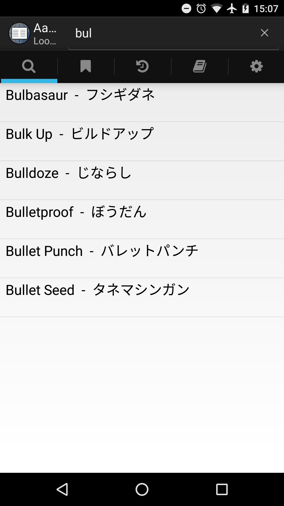
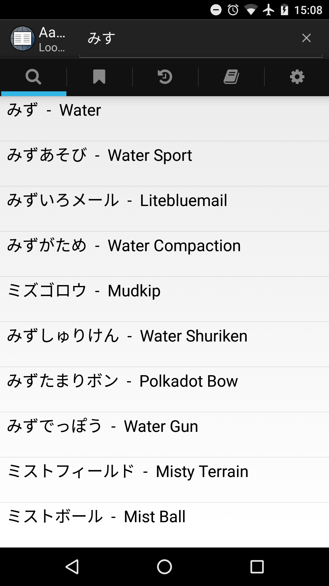

# Pokémon Dictionary

This is a dictionary containing not translations but mappings between the names of Pokémon, moves, items etc in all the game's languages. It is intended to be used with the Android app [Aard 2](https://play.google.com/store/apps/details?id=itkach.aard2).

If you find yourself missing something, or if you find any mistakes, please open an issue! You can also edit all_languages.csv and open a pull request.

## Installation

Install Aard 2, then download the .slob file for your languages to your device. From the app, go to the dictionary tab, press the "+" icon, and locate the `pokemon_lang_lang.slob` file. Now you can search in either of the languages!

## Screenshots

 

## Attribution and License

The translations are all taken from [Bulbapedia](http://bulbapedia.bulbagarden.net/). This dictionary is thus available under the [Attribution-NonCommercial-ShareAlike 2.5 Generic](https://creativecommons.org/licenses/by-nc-sa/2.5/) license.

Pokémon © 1995-2016 Nintendo/Creatures Inc./GAME FREAK inc. TM, ® and Pokémon character names are trademarks of Nintendo.
No copyright or trademark infringement is intended in using Pokémon content in this dictionary.

